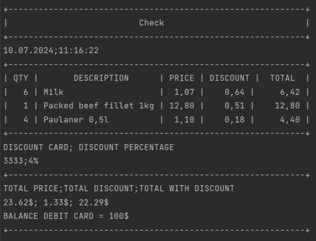

# Check Generator

Приложение генерирует чек для магазина исходя из входных параметров

- Создано на Java 21
- Gradle 8.5
- PostgreSQL
- Место хранения DDL/DML в файле `src/main/resources/data.sql`

# Инструкция по запуску:

При использовании **Java 21**:

```
./gradlew shadowJar
```

```
java -jar .\build\libs\app.jar 1-6 18-4 10-1 discountCard=3333 balanceDebitCard=100 saveToFile=./result_file.csv datasource.url=jdbc:postgresql://localhost:5432/check datasource.username=postgres datasource.password=postgres
```

Формат команды:

`java -jar .\build\libs\app.jar <items> discountCard=<cardNumber> balanceDebitCard=<balance> saveToFile=<saveToFile>
datasource.url=<url> datasource.username=<username> datasource.password=<password>`

Расшифровка команды:

- `<items>` - (id-quantity): ID товара-Количество
- `<cardNumber>` - номер дисконтной карты
- `<balance>` - баланс дебетовой карты
- `<saveToFile>` - путь к файлу с результатом
- `<url>` - URL базы данных
- `<username>` - имя пользователя базы данных
- `<password>` - пароль пользователя базы данных

### По команде создается файл `result_file.csv`:

```text
Date;Time
10.07.2024;11:16:22

QTY;DESCRIPTION;PRICE;DISCOUNT;TOTAL
6;Milk;1.07$;0.64$;6.42$
1;Packed beef fillet 1kg;12.80$;0.51$;12.80$
4;Paulaner 0,5l;1.10$;0.18$;4.40$

DISCOUNT CARD;DISCOUNT PERCENTAGE
3333;4%

TOTAL PRICE;TOTAL DISCOUNT;TOTAL WITH DISCOUNT
23.62$;1.33$;22.29$
```

### Дублирование чека в консоли:



### Функционал покрыт юнит-тестами:

