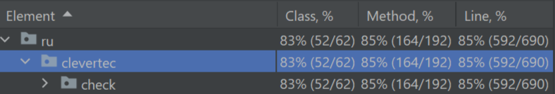

# Check Generator

Приложение генерирует чек для магазина исходя из входных параметров

- Создано на Java 21
- Gradle 8.5
- PostgreSQL
- Место хранения DDL/DML в файле `src/main/resources/data.sql`

# Инструкция по запуску:

По команде создается .war файл `/build/libs/clevertec-check.war`

```
./gradlew build
```

Необходимо также указать системные переменные:
```
datasource.url=jdbc:postgresql://localhost:5432/check
datasource.username=postgres
datasource.password=postgres
```

### Реазизовано RESTFUL-API(Servlet) приложение:
- Получение чека. `POST http://localhost:8080/check`:
```
{
    "products": [
        {
            "id": 7,
            "quantity": 1
        },
        {
            "id": 8,
            "quantity": 2
        }
                ],
    "discountCard": 1111,
    "balanceDebitCard": 100
}
```
Ответ:
```
Date;Time
11.07.2024;01:19:41

QTY;DESCRIPTION;PRICE;DISCOUNT;TOTAL
1;Packed apples 1kg;2.78$;0.08$;2.78$
2;Packed oranges 1kg;3.20$;0.19$;6.40$

DISCOUNT CARD;DISCOUNT PERCENTAGE
1111;3%

TOTAL PRICE;TOTAL DISCOUNT;TOTAL WITH DISCOUNT
9.18$;0.27$;8.91$
```

- Также работают все CRUD-операции с Товарами и Дисконтными картами(получение, удаление. добавление, изменение)

- При ошибках возвращаются соответвующие статус-коды.

### Функционал покрыт юнит-тестами:


