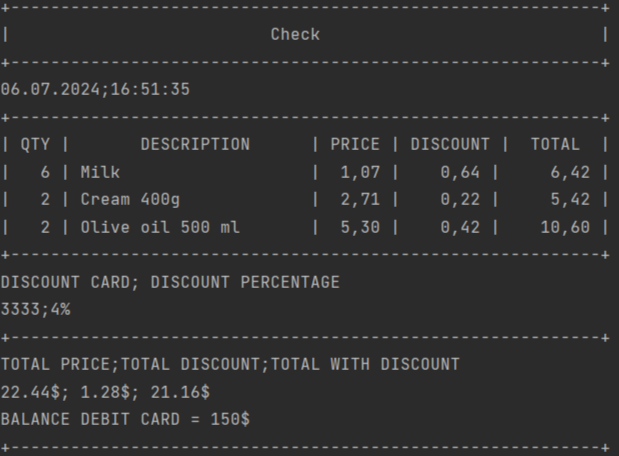

# Check Generator
Приложение генерирует чек для магазина исходя из входных параметров
- Создано на Java 21
- Место хранения файлов `products.csv` и `discountCards.csv`: `./src/main/resources`
# Инструкция по запуску:
При использовании **Java 21**:
```
./gradlew shadowJar
```
```
java -jar .\build\libs\app.jar 1-1 2-2 15-2 1-5 discountCard=3333 balanceDebitCard=150
```
Формат команды:

`java -jar .\build\libs\app.jar <items> discountCard=<cardNumber> balanceDebitCard=<balance>`

Расшифровка команды:
- `<items>` - (id-quantity): ID товара-Количество
- `<cardNumber>` - номер дисконтной карты
- `<balance>` - баланс дебетовой карты

### По команде создается файл `result.csv`:
```text
Date;Time
06.07.2024;16:39:45

QTY;DESCRIPTION;PRICE;DISCOUNT;TOTAL
6;Milk;1.07;0.64;6.42;

2;Cream 400g;2.71;0.22;5.42;

2;Olive oil 500 ml;5.30;0.42;10.60;

DISCOUNT CARD;DISCOUNT PERCENTAGE
3333;4%;

TOTAL PRICE;TOTAL DISCOUNT;TOTAL WITH DISCOUNT
22.44$;1.28$;21.16$
```

#### И сообщение в консоли:
